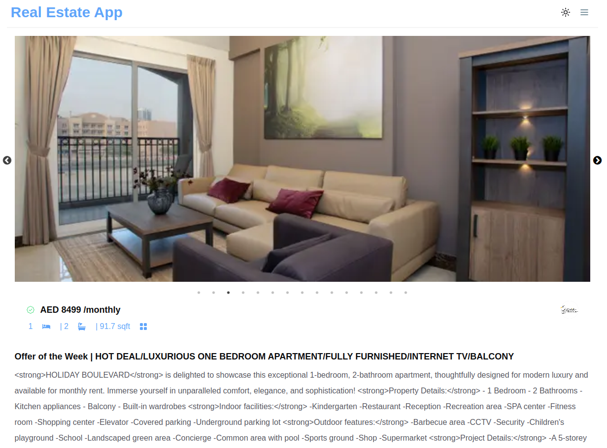

# 🏠 Real Estate App

Welcome to the Real Estate App! This project is built using `Next.js 15` and `React 19`, featuring the latest enhancements like **App Router**, **Server Components**, and **Server Actions**. It provides a seamless experience for exploring properties for rent and sale, powered by the **Bayut API**.

## 🚀 Features

- **App Router and Server Components**: Leverages Next.js' new capabilities for efficient routing and rendering.
- **Server Actions**: Asynchronous server-side actions enhance the functionality.
- **Interactive UI**: Built with **Chakra UI** for a modern and responsive design.
- **Property Slider**: Implemented using **React Slick** for smooth image transitions.
- **Real Estate Data**: Utilizes the **Bayut API** to fetch property information.
- **Search Filters**: Allows users to filter properties based on various criteria.

## 🔧 Technologies Used

- [Next.js 15](https://nextjs.org/) for the server-rendered React application.
- [React 19](https://reactjs.org/) for building UI components.
- [Chakra UI](https://chakra-ui.com/) for building accessible React apps.
- [next-nprogress-bar](https://www.npmjs.com/package/next-nprogress-bar) for indicating page loading progress.
- [React Slick](https://react-slick.neostack.com/) for carousel/slider functionality.

## 📦 API Integration

The app integrates with the **Bayut API** provided by Rapid API to fetch real estate data. The data includes property information for rent and sale purposes.

## 💡 Key Components

- **Navbar**: Accessible navigation bar with color mode toggle.
- **Property**: Displays property information, including name, location, and price.
- **ProgressBarProvider**: Manages the display of the progress bar during page transitions.
- **ImageScrollbar**: Carousel for property images using React Slick.
- **CustomImage**: A component for handling image loading and fallback.

## 🌍 Demo

Check out the live demo of the app: [Real Estate App Demo](https://real-estate-app-five-chi.vercel.app/)

## 📸 Screenshots

### Home Page


### Search Page


### Property Details Page



## 📄 Project Structure

- **Home Page**: Features banners for renting and buying, displaying property examples.
- **Search Page**: Contains an interactive UI for filtering property results based on various criteria.
- **Property Details Page**: Provides comprehensive information and a slider for property images.

## 🛠️ Setup

1. **Clone the Repository**:

   ```bash
   git clone https://github.com/yourusername/real-estate-app.git
   cd real-estate-app
   ```

2. **Install Dependencies**:

   ```bash
   npm install
   ```

3. **Set Environment Variables**:
   Create a `.env.local` file in the root directory and add your RapidAPI key:

   ```
   RAPIDAPI_KEY=your_rapidapi_key
   ```

   **Note**: You can get your RapidAPI key for Bayut API from [here](https://rapidapi.com/apidojo/api/bayut).

4. **Run the Development Server**:
   ```bash
   npm run dev
   ```
   Visit [http://localhost:3000](http://localhost:3000) to view the app.

## 📑 License

This project is licensed under the [MIT License](./LICENSE).
